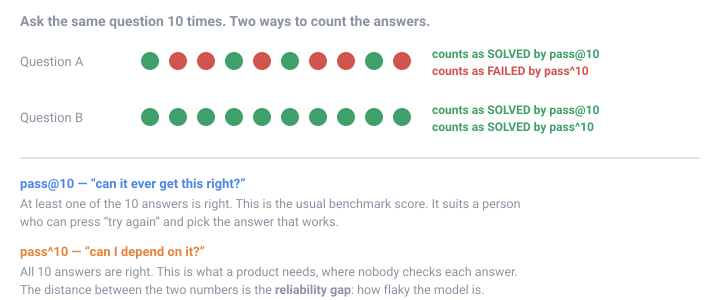
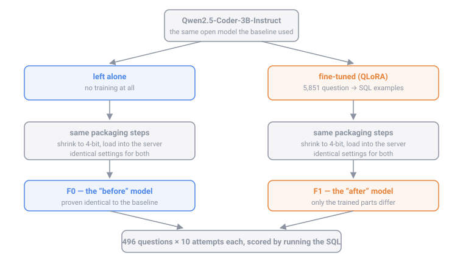
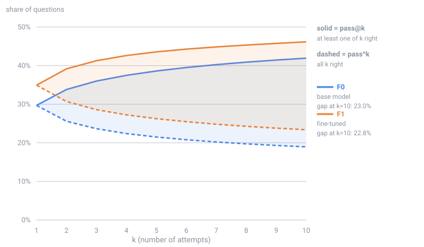
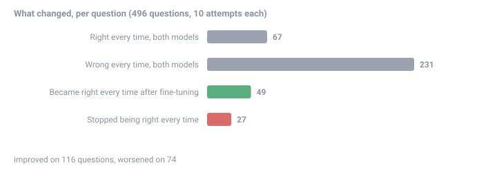

# Does fine-tuning buy reliability?

**The short version:** benchmarks usually ask *can the AI get this right?* Products need
*can I depend on it getting this right every time?* Those are different questions. This project
trains a small AI model on database questions and measures whether the training helps the
second question as much as the first.

**The answer: it helps both, by the same amount, and so it closes nothing.** Fine-tuning lifted
capability by 4.4 points and reliability by 4.4 points, leaving the distance between them — the
flakiness a product actually feels — unchanged, at 22.8%. Training made the model better. It did
not make it more dependable.

**And the finding with a price tag on it:** the fine-tuned small model matches a model twice its
size on the usual benchmark score — and is **12.7 points worse** at giving the same answer every
time. Swap them on the strength of the benchmark, as a normal evaluation would invite you to,
and you ship something markedly flakier with nothing in the numbers to warn you.

Everything here is measured on one computer, with free and open tools, and every number can be
reproduced from the files in this repository.

Want the full story, including the four ways the setup nearly fooled us? Read
[the long version](docs/EXPLAINED.md). Want to know what was actually run and what crashed?
[The run log](docs/RUN-LOG.md).

---

## 1. The problem, in plain words

Imagine you hire an assistant to answer questions about your company database. You ask:

> "Which schools in Alameda county had the highest average maths score last year?"

The assistant writes a database query, runs it, and gives you a number.

Now imagine you ask the **same question ten times**. Eight times you get the right answer, twice
you get a wrong one. Is that assistant good?

- If **you** are the one asking, it is fine. You notice the odd answer, press "try again", and
  keep the one that works.
- If the assistant is **inside your product**, answering customers while nobody watches, it is
  not fine at all. Two customers in ten get a wrong number and never find out.

Most AI benchmarks score the first situation. This project measures both, and asks a question
nobody had published an answer to:

> **When you train a model to be better at this task, does it also become more dependable — or
> does it just get better at being occasionally right?**

### The two ways of counting



- **pass@10** — "at least one of ten answers is right". The usual benchmark score. Call it
  **capability**.
- **pass^10** — "all ten answers are right". What a product needs. Call it **reliability**.
- The distance between them is the **reliability gap**. A big gap means a flaky model.

Both numbers come from the same ten answers. Nothing is measured twice; they are just counted
differently.

---

## 2. What this project did

Two models, treated identically except for one thing: one was trained, the other was not.



- **F0 — the "before" model.** The open model `Qwen2.5-Coder-3B-Instruct`, untouched.
- **F1 — the "after" model.** The same model, trained on 5,851 real examples of
  "question → correct database query".

Both were then packaged the same way and asked the same **496 questions, ten times each** —
just under 10,000 answers in total. Every answer was scored by actually running the query
against a real database and comparing the results with the official correct answer, so scoring
never depends on an opinion.

### Why F0 exists at all

You could simply compare the trained model against published numbers from an earlier project.
That would be a trap: the packaging steps, the server version, and even a stray invisible
character can change the score on their own, and you would credit the training for it.

So F0 is the **control**: the untrained model pushed through this project's own pipeline. If F0
does not reproduce the earlier published result, the pipeline is what changed, not the model.

**It does reproduce it.** Same 496 questions, ten attempts each:

| | capability (pass@10) | reliability (pass^10) | gap |
|---|---|---|---|
| Earlier published baseline | 42.3% | 18.8% | 23.6% |
| F0 (this project's pipeline) | 41.7% | 19.0% | 22.8% |
| Difference (95% confidence) | −0.6 [−2.6, +1.6] | +0.2 [−1.6, +2.2] | −0.8 [−3.6, +2.0] |

Every difference is small enough to be chance. Even better: F0's model file turned out to be
**byte-for-byte identical** to the published one — all 434 internal weight blocks and every
setting matched exactly.

---

## 3. Results

Both models answered the same 496 questions, ten times each — 9,920 scored answers. Here is the
whole result in one table:

| | capability (pass@10) | reliability (pass^10) | reliability gap |
|---|---|---|---|
| **F0** — before training | 41.7% | 19.0% | 22.8% |
| **F1** — after training | 46.2% | 23.4% | 22.8% |
| **Change** (95% confidence) | **+4.4** [+0.6, +8.3] | **+4.4** [+1.0, +7.9] | **+0.0** [−4.6, +4.4] |



**Training worked.** The model got better at the task, and not only on the forgiving "at least
one of ten" measure. Capability and reliability both rose by **4.4 points**, and both intervals
stay clear of zero, so neither rise is chance.

**Training did not buy dependability.** The distance between the two — the flakiness — did not
move. In the chart, both of F1's lines sit above F0's, and they stay exactly as far apart as
before.

That is the answer to the question this project set out to ask. Fine-tuning lifted the whole
model at once: questions it can now get right, it also gets right consistently; questions it was
flaky on, it is still flaky on. What training did **not** do was take what the model already
half-knew and make it steady. If you need a model that answers the same question the same way
every time, more training on more examples is not, by itself, the lever.

One caution about that headline zero. It is exactly zero, and that is a coincidence: 22 more
questions became right-at-least-once (58 gained it, 36 lost it), and 22 more became
right-every-time (49 gained, 27 lost). Two different counts, both landing on 22, and 22 out of
496 is 4.4355% either way — so the two rises cancel to the fourth decimal. Nothing deeper than
that is going on.

The honest reading is therefore **"no detectable change"**, not "provably identical". The
interval runs from −4.6 to +4.4, so a real change of a few points either way would not have
been detected by a study this size. The interval is the finding; the zero is arithmetic.

### The cheaper model that looks equal and is not

The other question this project set out to answer: a 7-billion-number model costs roughly twice
as much to serve as a 3-billion one. **Can a fine-tuned 3B replace a prompted 7B?** The earlier
project measured exactly that 7B on exactly these questions, so the comparison is available
without running anything new.

| | capability (pass@10) | reliability (pass^10) | gap |
|---|---|---|---|
| Prompted 7B (from the earlier project) | 49.8% | 36.1% | 13.7% |
| **Fine-tuned 3B** (F1) | 46.2% | 23.4% | 22.8% |
| Difference (95% confidence) | −3.6 [−7.7, **+0.6**] | −12.7 [−16.7, −8.5] | +9.1 [+4.4, +13.7] |

**On the benchmark score, they are a tie.** The capability interval includes zero: this study
cannot tell the fine-tuned 3B apart from the 7B twice its size on pass@10. That is the result a
team hoping to halve its serving bill is looking for, and on its own it would justify the swap.

**On dependability they are not remotely equal.** The 3B is **12.7 points worse** on pass^10,
and that interval is nowhere near zero. Counted per question: **92 questions the 7B answered
correctly all ten times, the fine-tuned 3B does not** — against 29 going the other way.

So the swap that looks free on a leaderboard costs a fifth of the model's repeatable answers. A
team that benchmarked the usual way would have seen the tie, shipped the small model, saved the
money, and shipped something substantially flakier without a number anywhere in the process
telling them so. **That, not the headline zero, is the practical finding of this project.**

> One honesty note on this table: the 7B's answers came from the earlier project on Ollama
> 0.34.1, and F1's on 0.34.2. That is precisely why F0 exists — it establishes that the version
> change and this pipeline move the numbers by less than chance (every interval includes zero,
> §2 above). Without F0 this comparison would not be safe to make.

### Which questions moved

Averages hide churn, so here is the same result counted one question at a time. **190 of the 496
questions changed**: 116 got better, 74 got worse.



| | Questions |
|---|---|
| Right all ten times, both models | 67 |
| Wrong all ten times, both models | 231 |
| Became right all ten times after training | 49 |
| Stopped being right all ten times | 27 |
| Moved, but stayed partly-right in both | 114 |
| Partly-right and unchanged | 8 |

Those six groups are exclusive and add to 496. The **49 against 27** is where the headline gain
comes from. The 27 is the part worth dwelling on: training is not a pure addition, and some
questions the untrained model had nailed every time, the trained model now sometimes gets wrong.

And **231 questions — nearly half — neither model ever got right, in twenty attempts between
them.** That is not flakiness; that is the ceiling of a 3-billion-number model on this
benchmark. No amount of steadying would have moved those, which is worth remembering before
reading any reliability number as a product guarantee.

---

## 4. What training did to the model

Training was stopped by the data, not by a guess. The model was checked every 50 steps against
**three databases it never saw during training**:


- **Blue** is how well it does on the questions it studies. It keeps improving — of course it
  does, those are the answers it is shown.
- **Orange** is how well it does on databases held back from it. This is the honest measure.
- Orange stops improving at **step 200** and then gets slightly worse, while blue keeps falling.
  That is **overfitting**: the model is memorising its practice questions instead of learning
  the skill. The step-200 version was kept, and the rest of the run is published as evidence.

One visible change: the trained model writes queries in the dataset's house style — short
aliases like `T1` and `T2`, one line, no trailing semicolon — where the untrained model writes
free-form SQL. It learned the *form* of the answers, which is exactly what training on
examples does.

---

## 5. Words explained

Every technical term used in this repository, in plain language.

| Term | What it means here |
|---|---|
| **Model** | The AI itself: a large pile of numbers that turns your question into an answer, one word at a time. |
| **Qwen2.5-Coder-3B** | The open model used. "3B" = 3 billion numbers inside it. Small enough to run on one home graphics card. |
| **SQL** | The language for asking questions of a database, e.g. `SELECT name FROM schools WHERE county = 'Alameda'`. |
| **Schema** | The list of tables and columns in a database. The model is shown this before each question. |
| **Prompt** | Everything sent to the model: the schema, the question, and a hint. |
| **Token** | A chunk of text, roughly a short word. Models read and write in tokens, not letters. |
| **Fine-tuning** | Further training of an existing model on your own examples, so it gets better at one specific job. |
| **LoRA / QLoRA** | A cheap way to fine-tune. Instead of rewriting all 3 billion numbers, you train a small set of extra numbers (an **adapter**) and leave the rest frozen. QLoRA also squeezes the frozen model to 4 bits so it fits on a small card. This trained 60 million numbers instead of 3 billion, on an 8 GB gaming GPU. |
| **Adapter** | The small file produced by LoRA training. Useless alone; it plugs into the original model. |
| **Merging** | Folding the adapter's numbers permanently into the model, so the result is one ordinary model again. |
| **Quantisation (4-bit, Q4_K_M)** | Storing each of the model's numbers with less precision so it takes less memory and runs faster — like saving a photo as a smaller JPEG. `Q4_K_M` is one specific recipe for doing it. |
| **GGUF** | The file format that holds a quantised model, used by llama.cpp and Ollama. |
| **Ollama** | The program that loads the model and answers requests on your own machine. Free, offline. |
| **Temperature** | How adventurous the model's word choices are. Above zero the same question can get different answers — which is exactly why reliability has to be measured over repeats. |
| **pass@k** | The chance that at least one of k attempts is right. Capability. |
| **pass^k** | The chance that all k attempts are right. Reliability. |
| **Reliability gap** | pass@k minus pass^k. How much of the benchmark score you cannot depend on. |
| **Execution accuracy** | How answers are scored here: run the model's query, run the official correct query, compare the results. Not text matching. |
| **BIRD** | The public benchmark this uses: thousands of real questions over real databases, with official correct queries. |
| **Contamination** | When training examples leak into the test set, so the model is graded on questions it practised. Checked here, by database and by question text, and the build refuses to run if any overlap is found. |
| **Validation set** | Questions held back from training, used to decide when to stop. Here: three whole databases the model never saw. |
| **Overfitting** | Memorising practice questions instead of learning the skill. Visible as the orange line above turning upward. |
| **Checkpoint** | A saved snapshot of the model during training. The best snapshot was kept, not the last. |
| **Confidence interval (95%)** | The range the true value is very likely to sit in. If the range includes zero, the result is indistinguishable from "no change". |
| **Bootstrap** | How that range is calculated: re-draw the questions at random thousands of times and see how much the answer moves. Questions are re-drawn, not individual attempts, because questions are what vary. |

---

## 6. Reproducing it

Needs: Python 3.12, [uv](https://docs.astral.sh/uv/), [Ollama](https://ollama.com), an NVIDIA
GPU with 8 GB for the training step (evaluation alone needs less), and roughly 60 GB of disk
for the benchmark databases.

```bash
# 1. build the training data, refusing to proceed if it overlaps the test set
uv run python scripts/prepare_data.py --p1-dir ../nl2sql-reliability \
    --model-dir ../models/Qwen2.5-Coder-3B-Instruct

# 2. fine-tune (about 3.5 hours on an RTX 3070)
uv run python scripts/train.py --model-dir ../models/Qwen2.5-Coder-3B-Instruct \
    --data prepared --out runs/f1

# 3. fold the adapter in, convert to a 4-bit file, load into Ollama
uv run python scripts/merge.py --base ../models/Qwen2.5-Coder-3B-Instruct \
    --adapter runs/f1/adapter --out merged/f1
uv run python scripts/to_gguf.py --source merged/f1 --out ../gguf/f1.Q4_K_M.gguf \
    --match-layout <the reference model file>
uv run python scripts/build_ollama_model.py --gguf ../gguf/f1.Q4_K_M.gguf --name p3-f1-qlora

# 4. measure both models, then compare
uv run python scripts/evaluate.py --arm p3-f0-base  --model p3-f0-base
uv run python scripts/evaluate.py --arm p3-f1-qlora --model p3-f1-qlora
uv run python scripts/analyse.py && uv run python scripts/make_charts.py
```

Tests: `uv run pytest`. They check the exact text sent to the model, the contamination rules,
and the data split.

---

## 7. What is in here

| Path | What it is |
|---|---|
| `src/nl2sql_finetune/template.py` | Builds the exact text sent to the model. |
| `src/nl2sql_finetune/data.py` | Contamination checks and the database-level split. |
| `src/nl2sql_finetune/tokens.py` | Counts tokens without needing PyTorch. |
| `scripts/prepare_data.py` | Builds the training and validation files, and a manifest of every decision. |
| `scripts/train.py` | The QLoRA fine-tune, including a check that only the answer is trained on. |
| `scripts/merge.py` | Folds the adapter into the model. |
| `scripts/to_gguf.py` | Converts and quantises via llama.cpp. |
| `scripts/gguf_compare.py` | Compares two model files block by block and setting by setting. |
| `scripts/build_ollama_model.py` | Loads a model into Ollama with verified settings. |
| `scripts/evaluate.py` | Runs the published measurement harness unchanged, recording provenance. |
| `scripts/analyse.py` | pass@k, pass^k, and the confidence intervals. |
| `scripts/make_charts.py` | Draws the figures from the results. |
| `results/` | Every answer the models gave, and the comparison reports. |
| `docs/EXPLAINED.md` | The whole study explained from scratch, no background assumed. |
| `docs/RUN-LOG.md` | What was run, on what machine, and every incident along the way. |
| `prepared/manifest.json` | Exactly which examples were trained on, and which were dropped and why. |

---

## 8. Honest limitations

- **One model, one size, one task.** 3 billion numbers, database questions. A bigger model or a
  different task may behave differently.
- **One training recipe.** One set of training settings, one run. Different settings could move
  the result.
- **The scorer is not perfect.** Correctness is decided by running the query and comparing
  results, which is far better than text matching, but a query can be right in a way the
  official answer did not anticipate.
- **Repeats are not independent of the machine.** All answers came from the same computer and
  the same server version, recorded alongside the results.
- **Limited power on the headline.** With 496 questions, the interval on the change in the gap
  is about ±4.5 points. A real improvement in dependability smaller than that would not have
  been detected, and this study would have reported the same "no detectable change". The finding
  is *not detected*, not *not there*.

---

## 9. Credits and licences

- **Model:** Built with Qwen. `Qwen2.5-Coder-3B-Instruct` is used under the Qwen Research
  License, Copyright (c) Alibaba Cloud. Research and non-commercial use only.
- **Data:** the [BIRD benchmark](https://bird-bench.github.io/) (CC BY-SA 4.0) and the
  filtered training split `birdsql/bird23-train-filtered`.
- **Measurement harness:** [`nl2sql-reliability`](https://github.com/MohanVishe/nl2sql-reliability),
  pinned to one commit and used unchanged, so the baseline this compares against is the
  baseline that was published.
- **Tools:** [llama.cpp](https://github.com/ggml-org/llama.cpp) (pinned release b11042),
  Hugging Face `transformers`, `peft`, `trl`, `bitsandbytes`, and Ollama.
- **Code in this repository:** MIT (see `LICENSE`). The model weights it produces are governed
  by the Qwen Research License, not by this one.
