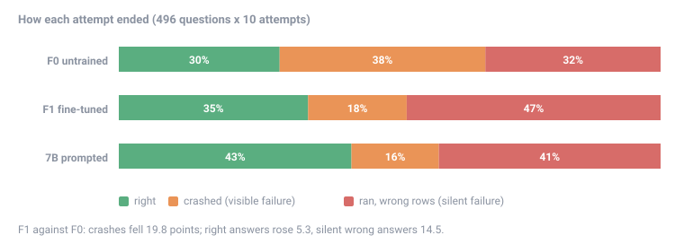
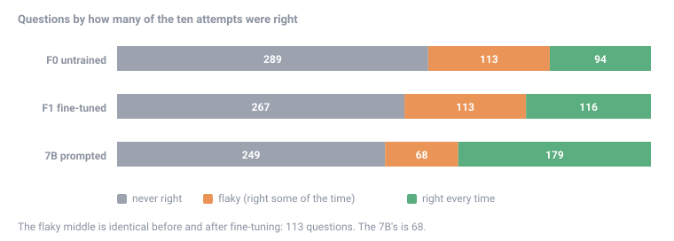

# Does fine-tuning buy reliability?

**The short version:** benchmarks usually ask *can the AI get this right?* Products need
*can I depend on it getting this right every time?* Those are different questions. This project
trains a small AI model on database questions and measures whether the training helps the
second question as much as the first.

**The answer: it helps both by about the same amount, and closes none of the gap.** Fine-tuning
lifted capability by 4.2 points and reliability by 4.4 points, leaving the distance between them
— the flakiness a product actually feels — where it was: 23.0% before, 22.8% after, a change of
−0.2 points [−4.8, +4.4] that this study cannot tell from zero. Training made the model better.
It did not make it detectably more dependable.

**And what the training did buy, which no benchmark score shows:** queries the database
outright rejects fell by 19.8 points of all attempts. Right answers rose by 5.2 points; queries
that run perfectly and return the wrong rows rose by 14.5. In net terms, fine-tuning traded
failures you can see for failures you cannot, roughly three to one.

**Against a model more than twice its size, the shortfall grows with the demand for
repeatability.** On the usual benchmark score (pass@10) this study cannot separate the fine-tuned
3B from a prompted 7B: −3.8 points [−7.9, +0.4]. On single-attempt accuracy it is **8.1 points
behind** [−11.6, −4.4], and on right-all-ten-times (pass^10) **12.7 points behind**
[−16.7, −8.5]. The 7B is right every time on 179 questions, the fine-tuned 3B on 116 — about a
third fewer. A comparison made on pass@10 alone would understate the difference the most.

Everything here is measured on one computer, with free and open tools, and every number can be
reproduced from the files in this repository plus the earlier project's published attempts.
All attempts are scored with the earlier project's corrected scorer (re-scored 2026-09-26; one
F0 attempt changed verdict — see [the run log](docs/RUN-LOG.md#re-scoring-2026-09-26)).

Want the full story, including the four ways the setup nearly fooled us? Read
[the long version](docs/EXPLAINED.md). Want to know what was actually run and what crashed?
[The run log](docs/RUN-LOG.md).

---

## 1. The problem, in plain words

Imagine you hire an assistant to answer questions about your company database. You ask:

> "Which schools in Alameda county had the highest average maths score last year?"

The assistant writes a database query, runs it, and gives you a number.

Now imagine you ask the **same question ten times**. Eight times you get the right answer, twice
you get a wrong one. Is that assistant good?

- If **you** are the one asking, it is fine. You notice the odd answer, press "try again", and
  keep the one that works.
- If the assistant is **inside your product**, answering customers while nobody watches, it is
  not fine at all. Two customers in ten get a wrong number and never find out.

Most AI benchmarks score the first situation. This project measures both, and asks a question
we did not find a published measurement of (see [related work](#10-related-work)):

> **When you train a model to be better at this task, does it also become more dependable — or
> does it just get better at being occasionally right?**

### The two ways of counting


- **pass@10** — "at least one of ten answers is right". The usual benchmark score. Call it
  **capability**.
- **pass^10** — "all ten answers are right". What a product needs. Call it **reliability**.
- The distance between them is the **reliability gap**. A big gap means a flaky model.

Both numbers come from the same ten answers. Nothing is measured twice; they are just counted
differently.

---

## 2. What this project did

Two models, treated identically except for one thing: one was trained, the other was not.


- **F0 — the "before" model.** The open model `Qwen2.5-Coder-3B-Instruct`, untouched.
- **F1 — the "after" model.** The same model, trained on 5,851 real examples of
  "question → correct database query".

Both were then packaged the same way and asked the same **498 questions, ten times each** —
9,960 answers in total, of which 9,920 (496 questions × 10 × 2 models) are scored; two
questions are excluded because their reference query times out. Each scored answer was judged by
actually running the query against a real database and comparing the results with the
reference answer, so scoring never depends on an opinion. The questions and reference answers
are [Arcwise-Plat-SQL](https://github.com/uiuc-kang-lab/text_to_sql_benchmarks) (Jin et al.
2026, CC BY-SA 4.0): BIRD's Mini-Dev questions with a corrected SQL answer key.

### Why F0 exists at all

You could simply compare the trained model against published numbers from an earlier project.
That would be a trap: the packaging steps, the server version, and even a stray invisible
character can change the score on their own, and you would credit the training for it.

So F0 is the **control**: the untrained model pushed through this project's own pipeline. If F0
does not reproduce the earlier published result, the pipeline is what changed, not the model.

**It does reproduce it.** Same 496 questions, ten attempts each:

| | capability (pass@10) | reliability (pass^10) | gap |
|---|---|---|---|
| Earlier published baseline | 42.5% | 18.8% | 23.8% |
| F0 (this project's pipeline) | 41.9% | 19.0% | 23.0% |
| Difference (95% confidence) | −0.6 [−2.8, +1.6] | +0.2 [−1.6, +2.0] | −0.8 [−3.6, +2.0] |

Every difference is small enough to be chance. Even better: **all 434 tensors** (the internal
weight blocks) in F0's model file are **byte-identical** to the published model's, and every
metadata setting is equal (`results/f0-vs-reference.json`). Only the order of those settings in
the file header differs, which is why the two files' SHA-256 hashes are not the same.

---

## 3. Results

Both models answered the same 496 questions, ten times each — 9,920 scored answers. Here is the
whole result in one table:

| | capability (pass@10) | reliability (pass^10) | reliability gap |
|---|---|---|---|
| **F0** — before training | 41.9% | 19.0% | 23.0% |
| **F1** — after training | 46.2% | 23.4% | 22.8% |
| **Change** (95% confidence) | **+4.2** [+0.4, +8.1] | **+4.4** [+1.0, +7.9] | **−0.2** [−4.8, +4.4] |


**Training worked.** The model got better at the task, and not only on the forgiving "at least
one of ten" measure. Capability rose by **4.2 points** and reliability by **4.4**, and both
intervals stay clear of zero, so neither rise is chance.

**Training did not buy dependability.** The distance between the two — the flakiness — did not
detectably move. In the chart, both of F1's lines sit above F0's, and they stay about as far
apart as before.

That is the answer to the question this project set out to ask. Fine-tuning lifted the whole
distribution at once: more questions became right at least once and more became right every
time, by about the same amount, while the band of questions the model is flaky on stayed
almost the same size (114, then 113) — though, as below, not the same questions. What training did **not** do was take what the
model already half-knew and make it steady. In this study, fine-tuning on 5,851 examples was
not, by itself, the lever for a model that answers the same question the same way every time.

One caution about how small that −0.2 is. At k = 10 every change is a whole number of
questions out of 496: 21 more questions became right-at-least-once (58 gained it, 37 lost it),
and 22 more became right-every-time (49 gained, 27 lost). The gap moved by one question, the
smallest step it can take. Nothing deeper than that is going on.

The honest reading is therefore **"no detectable change"**, not "provably identical". The
interval runs from −4.8 to +4.4, so a real change of a few points either way would not have
been detected by a study this size. The interval is the finding, not the point estimate.

### What training actually bought: fewer crashes, more confident mistakes

pass@10 and pass^10 only ask *was the answer right*. Every attempt actually ends one of three
ways, and the difference between the last two matters enormously to anyone shipping this:

- **right** — the query ran and returned the rows the reference answer returns;
- **crashed** — the database rejected the query. Ugly, but *visible*: the application gets an
  error it can catch, retry, or escalate;
- **ran, wrong rows** — the query executed perfectly and returned a clean table of the wrong
  data. **Nothing downstream can tell.** This is the failure that reaches a user.



| | right | crashed (visible) | wrong rows (silent) |
|---|---|---|---|
| **F0** — before training | 29.7% | 38.0% | 32.3% |
| **F1** — after training | 34.9% | 18.2% | 46.9% |
| **Change** (95% confidence) | **+5.2** [+2.2, +8.3] | **−19.8** [−23.2, −16.5] | **+14.5** [+11.2, +18.0] |

All three intervals exclude zero, so all three moves are real. And the arithmetic is
uncomfortable: **crashes fell 19.8 points; right answers rose 5.2; silent wrong answers rose
14.5.** These are shifts in rates across independent attempts, not the same queries tracked
from one model to the other — but in net terms, for every point of crashes that turned into a
right answer, nearly three turned into a silent wrong one.

That is what training on 5,851 examples bought at this scale. The pattern fits a model that
learned the *form* of a valid query — the right table names, the right joins, the dataset's
house style — faster than it learned to answer the question (one caveat on the answer key is in
§8). Judged on the benchmark, this is a clean 4-point win.
Judged as a product change, it moved failures from a pile you can monitor into a pile you
cannot. **A team watching its error-rate dashboard would have seen that dashboard improve by
half while the thing it is meant to protect against got worse.**

### Where the flakiness lives

A reliability gap can mean two completely different things, and they need opposite fixes. Either
every question is a coin flip, or most questions are settled and a fixed minority is unstable.
Counting questions by how many of their ten attempts succeeded tells you which:



| | never right | flaky (sometimes) | right every time |
|---|---|---|---|
| **F0** — before training | 288 | **114** | 94 |
| **F1** — after training | 267 | **113** | 116 |
| Prompted 7B | 248 | **69** | 179 |

The unstable middle is **114 questions before fine-tuning and 113 after.** Fine-tuning churned
the deck thoroughly — 151 of 496 questions changed category, and 191 changed how many of their
ten attempts were right — and left the size of the middle band almost where it was. The 7B is
unstable on 69.

That 114 → 113 is not a separate explanation of the gap result; it is the same fact. At k = 10
the gap *is* the share of questions that are sometimes right (114 / 496 = 23.0%, then
113 / 496 = 22.8%), so a band that barely moved and a gap that barely moved are one observation
stated twice. What the histogram adds
is shape: the gap comes from a minority band of unsettled questions, not from every question
being a coin flip, and fine-tuning moved questions in and out of that band without shrinking
it. In this comparison the prompted 7B had a smaller band (69 against 113); a single model pair
cannot say whether its size is the cause.

### The smaller model, measured three ways

The other question this project set out to answer is a purchasing one: **can a fine-tuned 3B
stand in for a prompted 7B?** The 7B is `Qwen2.5-Coder-7B-Instruct`, instruction-tuned by its
makers and given no task-specific fine-tuning here; it has 7.6 billion parameters to the 3B's
3.1 billion. On this machine it took 2.99 s per attempt on average against F1's 2.65 s (1.13×,
from `gen_seconds` in the result files); what the difference costs in production depends on
hardware and load, and was not measured here. The earlier project measured exactly that 7B on exactly these questions,
so the comparison is available without running anything new.

| | capability (pass@10) | single attempt (pass@1) | reliability (pass^10) | gap |
|---|---|---|---|---|
| Prompted 7B (from the earlier project) | 50.0% | 43.0% | 36.1% | 13.9% |
| **Fine-tuned 3B** (F1) | 46.2% | 34.9% | 23.4% | 22.8% |
| Difference (95% confidence) | −3.8 [−7.9, +0.4] | −8.1 [−11.6, −4.4] | −12.7 [−16.7, −8.5] | +8.9 [+4.2, +13.5] |

**On pass@10 this study cannot separate them.** The interval includes zero, and it also allows
a deficit of nearly eight points, so the reading is "not detected", not "equal" — the same
reading this section applies to the gap.

**On every stricter measure the 3B is behind.** Single-attempt accuracy — what a
one-attempt-per-question evaluation reports — is **8.1 points lower**, and right-all-ten-times
(pass^10) is **12.7 points lower**; neither interval comes near zero. Counted per question:
**92 questions the 7B answered correctly all ten times, the fine-tuned 3B does not** — against
29 going the other way. The 7B is right every time on 179 questions, the fine-tuned 3B on 116:
**about a third fewer** dependable answers.

So the deficit widens from 3.8 points on pass@10 to 8.1 on a single attempt to 12.7 on pass^10:
the more a use case depends on repeatable answers, the larger the shortfall, and the more a
pass@10 comparison understates it. **That widening, not the gap result, is the most practical
finding of this project.** (pass@1 comes from `results/summary-f1-vs-7b.json`, its interval from
`results/failure-modes.json`, where it is the "correct" rate.)

> One honesty note on this table: the 7B's answers came from the earlier project on Ollama
> 0.34.1, and F1's on 0.34.2. That is precisely why F0 exists — it establishes that the version
> change and this pipeline move the numbers by less than chance (every interval includes zero,
> §2 above). Without F0 this comparison would not be safe to make.

### Which questions moved

Averages hide churn, so here is the same result counted one question at a time. **191 of the 496
questions changed how many of their ten attempts were right**: 116 got better, 75 got worse. Of
those, 151 changed category (never / partly / always right).


| | Questions |
|---|---|
| Right all ten times, both models | 67 |
| Wrong all ten times, both models | 230 |
| Became right all ten times after training | 49 |
| Stopped being right all ten times | 27 |
| Became partly right (from never right) | 46 |
| Fell to never right (from partly right) | 29 |
| Partly right in both, number of right attempts changed | 40 |
| Partly right in both, unchanged | 8 |

Those eight groups are exclusive and add to 496; the counts are recomputed from the result files
by `tests/test_published_numbers.py`. The **49 against 27** is where the headline gain
comes from. The 27 is the part worth dwelling on: training is not a pure addition, and some
questions the untrained model had nailed every time, the trained model now sometimes gets wrong.

And **230 questions — nearly half — neither model ever got right, in twenty attempts between
them.** That is not flakiness; that is the ceiling of a 3-billion-number model on this
benchmark. No amount of steadying would have moved those, which is worth remembering before
reading any reliability number as a product guarantee.

---

## 4. What training did to the model

The model trained for the full **732 steps** (two passes over the data), and the checkpoint to
keep was chosen by the data, not by a guess: every 50 steps it was checked against **three
databases it never saw during training**, and the **best checkpoint (step 200) was selected on
that held-out validation loss**.


- **Blue** is how well it does on the questions it studies. It keeps improving — of course it
  does, those are the answers it is shown.
- **Orange** is how well it does on databases held back from it. This is the honest measure.
- Orange is lowest at **step 200** (0.1473; steps 200–350 all sit within 0.002 of it) and rises
  through the second pass, while blue keeps falling. That is **overfitting**: the model is
  memorising its practice questions instead of learning the skill. The step-200 checkpoint was
  kept, and the whole run is published as evidence.
- There was no evaluation at step 0, so how much of the held-out improvement the first 50 steps
  bought is not measured. Next run: log a step-0 evaluation.

One visible change: the trained model writes queries in the dataset's house style — short
aliases like `T1` and `T2`, one line, no trailing semicolon — where the untrained model writes
free-form SQL. It learned the *form* of the answers, which is exactly what training on
examples does.

---

## 5. Words explained

Every technical term used in this repository, in plain language.

| Term | What it means here |
|---|---|
| **Model** | The AI itself: a large pile of numbers that turns your question into an answer, one word at a time. |
| **Qwen2.5-Coder-3B** | The open model used. "3B" = 3 billion numbers inside it. Small enough to run on one home graphics card. |
| **SQL** | The language for asking questions of a database, e.g. `SELECT name FROM schools WHERE county = 'Alameda'`. |
| **Schema** | The list of tables and columns in a database. The model is shown this before each question. |
| **Prompt** | Everything sent to the model: the schema, the question, and a hint. |
| **Token** | A chunk of text, roughly a short word. Models read and write in tokens, not letters. |
| **Fine-tuning** | Further training of an existing model on your own examples, so it gets better at one specific job. |
| **LoRA / QLoRA** | A cheap way to fine-tune. Instead of rewriting all 3 billion numbers, you train a small set of extra numbers (an **adapter**) and leave the rest frozen. QLoRA also squeezes the frozen model to 4 bits so it fits on a small card. This trained about 30 million numbers (29.9 million) instead of 3 billion, on an 8 GB gaming GPU. |
| **Adapter** | The small file produced by LoRA training. Useless alone; it plugs into the original model. |
| **Merging** | Folding the adapter's numbers permanently into the model, so the result is one ordinary model again. |
| **Quantisation (4-bit, Q4_K_M)** | Storing each of the model's numbers with less precision so it takes less memory and runs faster — like saving a photo as a smaller JPEG. `Q4_K_M` is one specific recipe for doing it. |
| **GGUF** | The file format that holds a quantised model, used by llama.cpp and Ollama. |
| **Ollama** | The program that loads the model and answers requests on your own machine. Free, offline. |
| **Temperature** | How adventurous the model's word choices are. Above zero the same question can get different answers — which is exactly why reliability has to be measured over repeats. |
| **pass@k** | The chance that at least one of k attempts is right. Capability. |
| **pass^k** | The chance that all k attempts are right. Reliability. |
| **pass@1** | The chance that a single attempt is right: ordinary one-attempt accuracy, the average share of right attempts. |
| **Reliability gap** | pass@k minus pass^k. How much of the benchmark score you cannot depend on. |
| **Execution accuracy** | How answers are scored here: run the model's query, run the reference query, compare the results. Not text matching. |
| **BIRD** | The public benchmark this uses: thousands of real questions over real databases, with official correct queries. Training uses its training split. |
| **Arcwise-Plat-SQL** | The test set used here: 498 questions from BIRD's Mini-Dev set, over 11 databases, with the SQL answer key corrected (Arcwise's corrections, extended by Jin et al. 2026). The questions themselves are unchanged. |
| **Contamination** | When training examples leak into the test set, so the model is graded on questions it practised. Checked here, by database and by question text, and the build refuses to run if any overlap is found. |
| **Validation set** | Questions held back from training, used to choose which checkpoint to keep. Here: three whole databases the model never saw. |
| **Overfitting** | Memorising practice questions instead of learning the skill. Visible as the orange line above turning upward. |
| **Checkpoint** | A saved snapshot of the model during training. The best snapshot was kept, not the last. |
| **Confidence interval (95%)** | The range the true value is very likely to sit in. If the range includes zero, the result is indistinguishable from "no change". |
| **Bootstrap** | How that range is calculated: re-draw the questions at random thousands of times and see how much the answer moves. Questions are re-drawn, not individual attempts, because questions are what vary. |

---

## 6. Reproducing it

Needs: Python 3.12, [uv](https://docs.astral.sh/uv/), [Ollama](https://ollama.com) 0.34.2, an
NVIDIA GPU with 8 GB for the training step (evaluation alone needs less), and roughly 60 GB of
disk for the benchmark databases.

**Where each step runs.** Data preparation, evaluation, analysis and the tests need only the
base install and run anywhere, Windows included. Training, merging and the GGUF conversion need
the `train` extra (PyTorch with CUDA 12.6) and llama.cpp release b11042 in `../tools/`, and were
run under **WSL2 (Ubuntu 24.04)**: on the Windows machine used here, Smart App Control refuses
to load PyTorch's and llama.cpp's unsigned libraries. Any Linux machine with an NVIDIA GPU works
the same way.

**What sits next to this repo** (paths are relative to it):

- `../nl2sql-reliability` — a clone of the
  [measurement harness](https://github.com/MohanVishe/nl2sql-reliability) at commit `ed25506`,
  with its data fetched as its `docs/METHOD.md` ("Reproduce") describes. It supplies the
  Arcwise-Plat-SQL test set, the evaluation databases, and the earlier project's published
  attempts in `results/final/`.
- `../data/bird23-train-filtered` — the training questions, at the pinned revision:
  `uvx --from huggingface_hub hf download birdsql/bird23-train-filtered --repo-type dataset
  --revision 4068469807b255fcfc0816bdd520946fe460d256 --local-dir ../data/bird23-train-filtered`
  (its sha256 is recorded in `prepared/manifest.json`).
- `../data/train` — BIRD's training databases (`train.zip` from
  [bird-bench.github.io](https://bird-bench.github.io/), 8.9 GB, extracted).
- `../models/Qwen2.5-Coder-3B-Instruct` — the base model from Hugging Face.

```bash
# 0. install. The base install covers everything except training; the train extra adds
#    torch / transformers / peft / trl / bitsandbytes (Linux or WSL2 only, see above).
uv sync --extra dev                    # everywhere
uv sync --extra train --extra dev      # on the training machine

# 1. build the training data, refusing to proceed if it overlaps the test set
uv run python scripts/prepare_data.py --p1-dir ../nl2sql-reliability \
    --model-dir ../models/Qwen2.5-Coder-3B-Instruct

# 2. fine-tune (about 3.5 hours on an RTX 3070) -- Linux / WSL2
uv run python scripts/train.py --model-dir ../models/Qwen2.5-Coder-3B-Instruct \
    --data prepared --out runs/f1

# 3a. F0, the control: the untouched base model through the same conversion.
#     REF is the weights blob of Ollama's qwen2.5-coder:3b (the FROM line of
#     `ollama show qwen2.5-coder:3b --modelfile`), whose per-tensor layout is copied.
uv run python scripts/to_gguf.py --source ../models/Qwen2.5-Coder-3B-Instruct \
    --out ../gguf/f0-base.Q4_K_M.gguf --match-layout "$REF"           # Linux / WSL2
uv run python scripts/build_ollama_model.py --gguf ../gguf/f0-base.Q4_K_M.gguf --name p3-f0-base
uv run python scripts/gguf_compare.py ../gguf/f0-base.Q4_K_M.gguf --reference qwen2.5-coder:3b \
    --json results/f0-vs-reference.json

# 3b. F1: fold the adapter in, then the identical conversion
uv run python scripts/merge.py --base ../models/Qwen2.5-Coder-3B-Instruct \
    --adapter runs/f1/adapter --out merged/f1                         # Linux / WSL2
uv run python scripts/to_gguf.py --source merged/f1 --out ../gguf/f1-qlora.Q4_K_M.gguf \
    --match-layout "$REF"                                             # Linux / WSL2
uv run python scripts/build_ollama_model.py --gguf ../gguf/f1-qlora.Q4_K_M.gguf --name p3-f1-qlora
uv run python scripts/gguf_compare.py ../gguf/f1-qlora.Q4_K_M.gguf --reference qwen2.5-coder:3b \
    --json results/f1-vs-reference.json

# 4. measure both models, then compare
uv run python scripts/evaluate.py --arm p3-f0-base  --model p3-f0-base
uv run python scripts/evaluate.py --arm p3-f1-qlora --model p3-f1-qlora
uv run python scripts/analyse.py \
    --published ../nl2sql-reliability/results/final/local-3b-single.jsonl
uv run python scripts/analyse.py \
    --baseline ../nl2sql-reliability/results/final/local-3b-single.jsonl \
    --treatment results/p3-f0-base.jsonl --out results/summary-f0-vs-c.json

# how each attempt failed, and where the flakiness sits -- the 7B is read, never re-run
uv run python scripts/failure_modes.py \
    --reference ../nl2sql-reliability/results/final/local-7b-single.jsonl

uv run python scripts/make_charts.py

# 5. the crossover: the fine-tuned 3B against the earlier project's prompted 7B,
#    which is read from its published attempts and never re-run
uv run python scripts/analyse.py \
    --baseline ../nl2sql-reliability/results/final/local-7b-single.jsonl \
    --treatment results/p3-f1-qlora.jsonl --out results/summary-f1-vs-7b.json
```

Steps 4 (analysis) and 5 reproduce every committed file in `results/` exactly from the
published attempts, and step 0's base install is what CI runs. Steps 2–3 are recorded in
[the run log](docs/RUN-LOG.md) as run; they need the GPU and the large downloads, and the
trained adapter is not yet published (see Next, §8), so F1 cannot be re-evaluated without
retraining.

Tests: `uv run python -m pytest`. They check the exact text sent to the model, the contamination
rules, the data split, the estimators, and the headline numbers and counts this README quotes
against the result files. Three of them need the data above and skip without it; point `P1_DIR`, `MODEL_DIR`,
`TRAIN_JSONL` and `TRAIN_DBS` at it to run all of them.

---

## 7. What is in here

| Path | What it is |
|---|---|
| `src/nl2sql_finetune/template.py` | Builds the exact text sent to the model. |
| `src/nl2sql_finetune/data.py` | Contamination checks and the database-level split. |
| `src/nl2sql_finetune/tokens.py` | Counts tokens without needing PyTorch. |
| `src/nl2sql_finetune/stats.py` | The one bootstrap both analyses share. |
| `src/nl2sql_finetune/paths.py` | Keeps machine-specific paths out of the published results. |
| `tests/test_published_numbers.py` | Recomputes every count this README quotes from the result files. |
| `scripts/prepare_data.py` | Builds the training and validation files, and a manifest of every decision. |
| `scripts/train.py` | The QLoRA fine-tune, including a check that only the answer is trained on. |
| `scripts/merge.py` | Folds the adapter into the model. |
| `scripts/to_gguf.py` | Converts and quantises via llama.cpp. |
| `scripts/gguf_compare.py` | Compares two model files block by block and setting by setting. |
| `scripts/build_ollama_model.py` | Loads a model into Ollama with verified settings. |
| `scripts/evaluate.py` | Runs the published measurement harness unchanged, recording provenance. |
| `scripts/analyse.py` | pass@k, pass^k, and the confidence intervals. |
| `scripts/failure_modes.py` | Loud failures vs silent ones, and the flaky middle. |
| `scripts/make_charts.py` | Draws the figures from the results. |
| `results/` | Every answer the models gave, and the comparison reports. |
| `docs/EXPLAINED.md` | The whole study explained from scratch, no background assumed. |
| `docs/RUN-LOG.md` | What was run, on what machine, and every incident along the way. |
| `prepared/manifest.json` | Exactly which examples were trained on, and which were dropped and why. |

---

## 8. Limitations and next steps

- **One model, one size, one task.** 3 billion numbers, database questions. A bigger model or a
  different task may behave differently.
- **One model pair in the 7B comparison.** The smaller flaky band of the 7B (69 against 113) is
  one observation; this study cannot say whether model size is what causes it.
- **One training recipe.** One set of training settings, one run, one seed. Different settings
  could move the result.
- **Trained on one answer key, scored on another.** The model learned from BIRD's original
  training SQL; it was scored against Arcwise-Plat-SQL's corrected answers. If the correction
  changed conventions the training data still follows, some of the rise in silent wrong answers
  could be convention mismatch rather than wrong reasoning. Next: re-score a sample of F1's
  silent wrong answers by hand, and compare against the uncorrected Mini-Dev key.
- **The scorer is not perfect.** Correctness is decided by running the query and comparing
  results, which is far better than text matching, but a query can be right in a way the
  reference answer did not anticipate.
- **Repeats are not independent of the machine.** All answers came from the same computer and
  the same server version, recorded alongside the results.
- **One temperature.** Everything was measured at temperature 0.2, the setting the earlier
  project published. Flakiness is partly a function of that dial: at temperature zero repeated
  answers become largely identical, and how capability would move with it was not measured.
  These conclusions describe one plausible product setting, not every setting.
- **The kept checkpoint was chosen by validation loss, not by accuracy.** Loss is a proxy for
  being right, and the two can disagree; steps 200–350 were within 0.002 of each other on it. A
  checkpoint picked by execution accuracy on a held-out set might have been a slightly different
  model, at the cost of a second evaluation budget.
- **Trained in 4-bit, merged in 16-bit, served in 4-bit.** Ordinary QLoRA practice, but it means
  the weights the adapter trained against are not the weights that answered the questions. The
  measured effect is the effect of the adapter as deployed. Next: evaluate one 16-bit merged
  checkpoint on a subset of questions to bound the difference.
- **The kept model saw about half of one pass over the data.** Step 200 of 732 is roughly 0.55
  of an epoch, and validation loss rose after it. This is a study of *light* fine-tuning — which
  is what the validation loss selected — not of training to exhaustion.
- **Limited power on the headline.** With 496 questions, the interval on the change in the gap
  is about ±4.5 points. A real improvement in dependability smaller than that would not have
  been detected, and this study would have reported the same "no detectable change". The finding
  is *not detected*, not *not there*.

**Next:**

- **Publish the adapter** (about 120 MB) on Hugging Face with the Qwen Research License, the
  NOTICE and a statement of modification, so F1 can be re-evaluated without retraining.
- Log a step-0 validation evaluation, so the held-out improvement training bought is measured.
- Commit the hypotheses and decision rule to the repository before training starts, so the
  pre-registration carries its own timestamp (see [EXPLAINED §7](docs/EXPLAINED.md)).
- A larger question set, to resolve changes in the gap smaller than ±4.5 points.

---

## 9. Credits and licences

- **Model:** Built with Qwen. `Qwen2.5-Coder-3B-Instruct` is used under the Qwen Research
  License, Copyright (c) Alibaba Cloud. Research and non-commercial use only. The comparison arm
  is `Qwen2.5-Coder-7B-Instruct`, measured by the earlier project and never re-run here.
- **Evaluation data:** [Arcwise-Plat-SQL](https://github.com/uiuc-kang-lab/text_to_sql_benchmarks)
  by Tengjun Jin, Yoojin Choi, Yuxuan Zhu and Daniel Kang (arXiv
  [2601.08778](https://arxiv.org/abs/2601.08778), VLDB 2026), building on Arcwise's corrections
  of BIRD Mini-Dev. CC BY-SA 4.0. Read from the harness's data directory; not redistributed here.
- **Training data:** the [BIRD benchmark](https://bird-bench.github.io/) (Li et al. 2023,
  CC BY-SA 4.0) — its training databases and the filtered training split
  [`birdsql/bird23-train-filtered`](https://huggingface.co/datasets/birdsql/bird23-train-filtered)
  at revision `4068469`. `prepared/manifest.json` records which examples were used; the data
  itself is not redistributed.
- **Measurement harness:** [`nl2sql-reliability`](https://github.com/MohanVishe/nl2sql-reliability),
  pinned to one commit and used unchanged, so the baseline this compares against is the
  baseline that was published.
- **Tools:** [llama.cpp](https://github.com/ggml-org/llama.cpp) (pinned release b11042),
  Hugging Face `transformers`, `peft`, `trl`, `bitsandbytes`, and Ollama.
- **Code in this repository:** MIT (see `LICENSE`). The model weights it produces are governed
  by the Qwen Research License, not by this one.

---

## 10. Related work

- **pass@k.** The unbiased estimator used here comes from Chen et al. 2021, *Evaluating Large
  Language Models Trained on Code* ([arXiv:2107.03374](https://arxiv.org/abs/2107.03374)).
- **pass^k.** The all-k-attempts reliability measure comes from Yao et al. 2024, *τ-bench: A
  Benchmark for Tool-Agent-User Interaction in Real-World Domains*
  ([arXiv:2406.12045](https://arxiv.org/abs/2406.12045)).
- **LoRA and QLoRA.** Hu et al. 2021 ([arXiv:2106.09685](https://arxiv.org/abs/2106.09685));
  Dettmers et al. 2023 ([arXiv:2305.14314](https://arxiv.org/abs/2305.14314)).
- **The benchmark and its answer key.** BIRD: Li et al. 2023
  ([arXiv:2305.03111](https://arxiv.org/abs/2305.03111)). Annotation errors in BIRD Mini-Dev and
  the corrected Arcwise-Plat-SQL: Jin et al. 2026
  ([arXiv:2601.08778](https://arxiv.org/abs/2601.08778)).
- **Fine-tuning and output diversity** — the basis of the H-diversity hypothesis. Li et al.
  2024, *Preserving Diversity in Supervised Fine-Tuning of Large Language Models*
  ([arXiv:2408.16673](https://arxiv.org/abs/2408.16673)); Klypa et al. 2026, *Diversity in
  Large Language Models under Supervised Fine-Tuning*
  ([arXiv:2605.00195](https://arxiv.org/abs/2605.00195)). Both report narrower outputs after
  supervised fine-tuning; neither measures pass^k or text-to-SQL.
- **Training that moves pass@1 and pass@k differently** — the basis of the H-coverage
  hypothesis. Yue et al. 2025, *Does Reinforcement Learning Really Incentivize Reasoning
  Capacity in LLMs Beyond the Base Model?* ([arXiv:2504.13837](https://arxiv.org/abs/2504.13837)),
  which finds RL-trained models ahead at small k and base models ahead at large k, and
  distillation expanding what a model can solve.
- **Small models fine-tuned for text-to-SQL**, all measured on capability rather than
  repeatability: SLM-SQL ([arXiv:2507.22478](https://arxiv.org/abs/2507.22478)), CSC-SQL
  ([arXiv:2505.13271](https://arxiv.org/abs/2505.13271)), MSc-SQL
  ([arXiv:2410.12916](https://arxiv.org/abs/2410.12916)), DB-GPT-Hub
  ([arXiv:2406.11434](https://arxiv.org/abs/2406.11434)), and a controlled study of LoRA rank
  and quantisation for text-to-SQL on a 60M-parameter model
  ([arXiv:2607.25583](https://arxiv.org/abs/2607.25583)).

We did not find a published measurement of how fine-tuning changes the gap between pass@k and
pass^k; that is the question this study adds to the work above.
