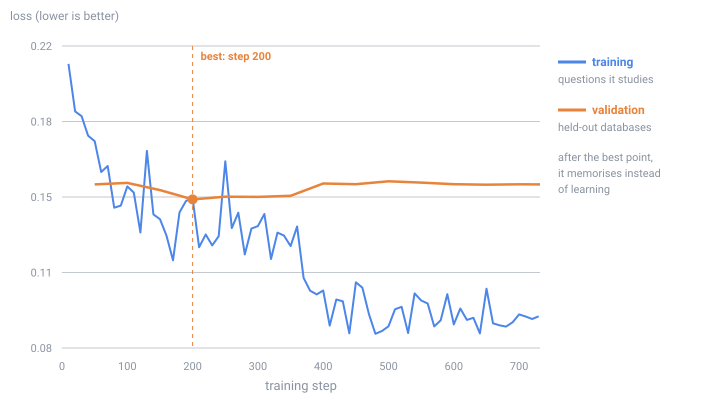

# Explained, from scratch

This walks through the whole study: why the question is worth asking, how the experiment was
built, which traps were found along the way, and what the numbers do and do not say. No prior
knowledge of machine learning is assumed. Terms are explained where they first appear, and the
README has a glossary if you want them in one place.

---

## 1. Why "accuracy" is not the number you want

A language model is a program that continues text. Give it a question and a description of a
database, and it continues with a database query. Run that query, and you get an answer.

Here is the part people find surprising: **ask the same question twice and you can get two
different answers.** The model does not look up a fact, it picks words one at a time according
to probabilities, and unless you force it to always pick the single most likely word, there is
randomness in every choice. That randomness is deliberate. Forcing the most likely word every
time — "temperature zero" — makes models repetitive and, on this kind of task, often worse.

So "the model is 42% accurate" is a summary of one roll of the dice per question. It hides the
question a product owner actually has: *if this thing answers a thousand customer questions
tomorrow, how many will be right?*

Two numbers, computed from the same ten answers per question, separate this:

- **pass@10** — at least one of ten attempts is right. This is the familiar benchmark score.
  It answers *"can the model do this at all?"*
- **pass^10** — all ten attempts are right. It answers *"can I depend on it?"*

Nobody sane runs a product on "at least one of ten". But benchmark scores rarely ask whether an
answer repeats: they report one attempt, or the best of several, because benchmarks grew up
around research, where a human reads the output.

The distance between the two is the **reliability gap**. For the untrained model measured here
it is over 20 points: a benchmark score of 41.9% comes with only 19.0% of questions answered
correctly every single time.

The estimators themselves are not new. pass@k is standard in code generation (Chen et al. 2021),
and pass^k comes from agent-benchmark work (τ-bench, Yao et al. 2024). We did not find a
published measurement of what happens to *the gap* when you fine-tune; that is the question
this study adds. The README's [related work](../README.md#10-related-work) section lists the
papers this builds on, with links.

---

## 2. The question

**Fine-tuning** means taking a model someone else trained and training it further on your own
examples, so it gets better at one specific job. It is the standard move when a general model
is not good enough at your task, and it reliably raises benchmark scores.

Does it also make the model **dependable**? Two stories, both plausible:

- **It should get worse.** Training on examples is known to reduce variety in a model's output.
  A model that has learned one house style will produce nearly the same answer every time. If
  those answers are right, reliability jumps. If the model's favourite answer is wrong, it will
  be wrong ten times out of ten — and the questions it used to get right occasionally, it now
  never gets right. Capability could rise while the gap widens.
- **It should get better.** Fine-tuning teaches the shape of a correct answer. Much of the
  flakiness in an untrained model is formatting drift and hesitation, not genuine confusion.
  Removing that could close the gap.

The prediction and the deciding rule were written into the project plan before training (that
plan was not independently timestamped): the headline is the **change in the gap**, with a
confidence interval, and the interval has to exclude zero before the result is called a finding
at all.

---

## 3. The experimental design, and the trap in it

The comparison is between two models:

- **F0** — the base model, untouched.
- **F1** — the same model, fine-tuned on 5,851 examples of question → correct query.

Both are then packaged identically and asked the same 496 questions ten times each.

### Why not just compare against the published baseline?

An earlier project already measured this base model on these questions and published the
result. It is tempting to fine-tune, measure the fine-tune, and compare against those published
numbers. That would be a trap, and it is the single most important design decision here.

Between "the published number" and "my number" sits a whole pipeline: the file format
conversion, the compression settings, the serving software and its version, the chat template,
invisible characters in a configuration file. Any of them can move a score by a point or two.
If any of them changed, you would credit the fine-tuning for it.

So the untrained model is pushed through **this project's own pipeline** and measured again.
That is F0, the control. If F0 does not reproduce the published number, the pipeline moved,
not the model.

This turned out to matter more than expected: Ollama, the serving program, **updated itself**
from 0.34.1 to 0.34.2 between the earlier study and this one. Both of this study's models ran on
0.34.2, but the published baseline and the 7B ran on 0.34.1. Without F0, that change alone
would have been indistinguishable from an effect of fine-tuning.

### Four ways the pipeline nearly lied

Getting F0 to be the same model as the published one took four fixes. Each was caught by an
automated check rather than by reading code, which is the point: nobody would have spotted any
of these by looking.

1. **The compression recipe is not one recipe.** The format used, `Q4_K_M`, shrinks most of the
   model's numbers to 4 bits but keeps some at 6 bits for quality. *Which* parts get the extra
   bits is decided by a rule inside the conversion tool — and that rule changed between
   versions. The freshly converted model matched the published one on 404 of its 434 internal
   blocks, and the 30 that differed were not wrong, just stored at different precision. The fix
   was to read the published file's layout and force the same choice.

2. **Hidden sampling defaults.** The conversion tool copies a handful of settings out of the
   model's configuration — temperature 0.7, top_p 0.8 and so on — into the model file. The
   published file has none of them. A serving program that reads those settings would have run
   the new models with different randomness from the baseline, producing a difference that
   looked like a result. They are now stripped, and the file comparison checks *every* setting
   rather than a hand-picked list, because a hand-picked list is exactly how this one slipped
   through the first time.

3. **Invisible characters.** Windows silently converts line endings when writing text files.
   Those converted line endings landed inside the **chat template** — the wrapper text that
   surrounds every question. Every single prompt would have differed from the baseline's by
   invisible characters. The build script compares the resulting template with the reference
   and refused the model until it was written correctly.

4. **A dropped flag after merging.** After training, the small adapter file is folded back into
   the model, and the tokenizer files are saved alongside. The library used for saving quietly
   omitted one setting — whether to prepend a special "beginning of text" marker. With the
   setting missing, the serving program's own default decides, and the fine-tuned model could
   have been fed a token the baseline never saw. Tokenizer files are now copied byte-for-byte
   instead of being re-saved.

After those four fixes, every one of the **434 tensors** in F0's file is **byte-identical** to
the published model's, and every metadata setting matches; only their order in the file header
differs, which is why the two files' SHA-256 hashes differ. And when measured, F0 reproduced the
published scores within noise. Only then was F1 worth comparing to anything.

---

## 4. Building the fine-tune

### The data, and the thing that ruins studies

Training used 5,851 question-and-query pairs from the BIRD benchmark's training split, covering
65 databases.

The failure that quietly destroys studies like this is **contamination**: a training example
that is also in the test set. The model then looks brilliant because it is being graded on its
homework. The check here is deliberately blunt: no database may appear in both sets, and no
question may appear in both after normalising the text. The build refuses to write any files if
either check fires. On the real data: zero shared databases, zero shared questions.

A second, subtler rule: the validation set — the questions used to choose which checkpoint to
keep — is made of **three whole databases** that never appear in training. Holding out individual
questions would not be enough, because a model that has seen a database's structure has an
advantage on every question about it.

Examples longer than 3,072 tokens were dropped, not shortened. Shortening an example teaches the
model to answer a question it was never fully shown. All 383 dropped examples came from a single
database whose structure alone fills about 5,000 tokens.

### The training itself

Training all 3 billion numbers in the model needs far more memory than a home graphics card
has. **QLoRA** solves this in two moves: compress the original model to 4 bits and freeze it,
then train a small set of new numbers bolted alongside — an **adapter** of about 30 million
numbers (29.9 million). Peak memory: 4.1 GB, on an 8 GB card, in 3.5 hours.

One check runs before training starts. The model sees the database structure, the question, and
then writes the answer; only the answer should be trained on. Getting this wrong — training on
the whole text — produces a model that looks trained and is quietly worse. So the first batch is
decoded and the trained-on portion must be exactly the answer and its end marker, or the script
refuses to run.

### Choosing which checkpoint to keep

Training longer is not better. The run went the full 732 steps (two passes over the data), and
the model was checked against the held-out databases every 50 steps:

The score on questions it studies keeps improving. The loss on held-out databases is lowest at
step 200 (0.1473; steps 200–350 are all within 0.002 of it) and rises through the second pass.
That divergence is **overfitting** — memorising instead of learning — and it decides which
version to keep: the best checkpoint, step 200, was selected on held-out validation loss, not
the final one. The whole run is published, because knowing where a recipe starts to hurt is
part of the result. There was no evaluation at step 0, so the held-out improvement the first 50
steps bought is not measured; the next run logs one.

One change is visible without any statistics. Asked a question, the untrained model writes
free-form SQL, while the fine-tuned model writes in the dataset's house style: short table
aliases, one line, no trailing semicolon. It learned the *form* of the answers.

---

## 5. How the answers are scored

Every answer is scored by **running it**. The model's query and the reference query are both
executed against the real database, and the result tables are compared. The questions and
reference queries are **Arcwise-Plat-SQL** (Jin et al. 2026, CC BY-SA 4.0): the 498 questions
of BIRD's Mini-Dev set with the SQL answer key corrected, after its authors found annotation
errors in more than half of the original. A query that is
worded differently but returns the right rows counts as right; a query that looks plausible but
returns the wrong rows counts as wrong.

Two questions are excluded because their reference query takes longer than 30 seconds to run
against the database — the same two the published baseline excluded. That leaves 496 scored
questions, each answered ten times by each model: 4,960 scored answers per model, 9,920 in all
(9,960 answer records are published, including the 40 for the two excluded questions).

The measurement code is the earlier project's, used **unchanged and pinned to one commit**. The
wrapper script here refuses to run if that code has been modified, and records the serving
program's version next to the results.

---

## 6. Reading the numbers honestly

Both scores are computed with the standard unbiased estimators, from the same ten answers per
question.

The comparison needs three safeguards:

- **Same questions.** Both arms are scored on the questions both answered, not on each arm's own
  best set.
- **Uncertainty, stated.** Every difference comes with a 95% confidence interval from a
  **bootstrap**: re-draw the 496 questions at random, with replacement, ten thousand times, and
  watch how much the answer moves. If the resulting range includes zero, the honest reading is
  "no detectable change", however suggestive the headline looks.
- **Questions, not attempts.** The bootstrap re-draws questions, because questions are the
  independent unit. Re-drawing individual attempts would produce a far narrower interval and a
  false sense of precision.

The analysis was also written twice — once here, once in the earlier project — and the two
implementations agree to the decimal on the control comparison.

---

## 7. The result

All three arms, on the 496 questions every arm answered, ten attempts each:

| arm | pass@10 | pass^10 | gap |
|---|---|---|---|
| F0 — untrained, through this pipeline | 41.9% | 19.0% | 23.0% |
| F1 — fine-tuned | 46.2% | 23.4% | 22.8% |
| published baseline (control, for reference) | 42.5% | 18.8% | 23.8% |

Paired differences, F1 − F0, at k = 10, with 95% intervals from 10,000 bootstrap resamples of
the 496 questions:

| quantity | change | 95% interval | reading |
|---|---|---|---|
| capability (pass@10) | +4.2 | [+0.4, +8.1] | excludes zero — a real rise |
| reliability (pass^10) | +4.4 | [+1.0, +7.9] | excludes zero — a real rise |
| **reliability gap** | **−0.2** | **[−4.8, +4.4]** | includes zero — no detectable change |

### The −0.2 is one question

At k equal to the number of attempts collected, the two estimators stop being estimates and
become counts: pass@10 is just "this question was right at least once", pass^10 is "this
question was right all ten times". So each difference is a whole number of questions divided
by 496.

- Right at least once: **58 questions gained it, 37 lost it — net +21.**
- Right every time: **49 questions gained it, 27 lost it — net +22.**

The net counts are 21 and 22, so the gap moved by one question out of 496, −0.2 points: the
smallest step a gap measured this way can take. (Before the earlier project corrected its
scorer, both counts were 22 and the change was exactly zero; one F0 attempt on question 728 was
re-scored right, which is the whole difference. The run log has the details.) Either way the
point estimate means little on its own.

What carries meaning is the interval around it: **[−4.8, +4.4]**. A study of 496 questions
cannot see a change in the gap smaller than roughly four and a half points. Had fine-tuning
shaved three points off the flakiness, this design would have reported the same honest "no
detectable change". The correct claim is *this study did not detect a change*, and the correct
follow-up is a larger question set, not a louder adjective.

### What kind of wrong: the failure that stops being visible

Scoring an answer right or wrong throws away something a team running this in production would
badly want to know. A wrong answer arrives in one of two ways.

Either the database **rejects** the query — a column that does not exist, a join that cannot be
made — and the program calling the model gets an exception. That is a bad answer, but it is a
*loud* one: it can be caught, retried, logged, counted on a dashboard, escalated to a human.

Or the query **runs**, and hands back a neat table of the wrong rows. Nothing anywhere in the
system can tell. There is no exception, no warning, no signal of any kind. Someone reads the
number and believes it.

Splitting the same 9,920 attempts three ways:

| | right | crashed (loud) | ran, wrong rows (silent) |
|---|---|---|---|
| F0 — untrained | 29.7% | 38.0% | 32.3% |
| F1 — fine-tuned | 34.9% | 18.2% | 46.9% |
| difference, paired | +5.2 [+2.2, +8.3] | −19.8 [−23.2, −16.5] | +14.5 [+11.2, +18.0] |

Every interval excludes zero. Follow the arithmetic: crashing queries fell by **19.8 points**,
right answers rose by **5.2 points**, and queries that execute cleanly and return the wrong data
rose by **14.5 points**. The attempts are independent samples, so no single query is being
followed from one model to the other; these are shifts in rates. But in net terms, of the
ground crashes gave up, about a quarter went to right answers and three quarters to silent
wrong ones.

This is worth sitting with, because it is one of the two most practically important results in
the study (the other is the 7B comparison below) and a right-or-wrong benchmark score does not
surface it. Training on thousands of correct examples taught
the model what a valid query *looks like* — real column names, sane joins, the dataset's house
style — far faster than it taught the model to answer the question in front of it. The model
became fluent before it became correct.

For a leaderboard, that is a clean win: +4.2 points. For a system, it is a trade of visible
failure for invisible failure at about three to one. A team measuring "SQL error rate" — an
entirely sensible thing to monitor — would have watched that metric halve and concluded the
fine-tune was a success, while the rate of confidently wrong answers reaching users rose by
fourteen points.

### Where the flakiness lives

The reliability gap is an average, and averages hide shape. A 23-point gap could mean every
question is a coin flip, or it could mean nearly everything is settled and a stubborn minority
is unstable. Those two worlds need opposite engineering, so it is worth knowing which one this
is. Counting questions by how many of their ten attempts succeeded answers it:

| | never right | flaky | right every time |
|---|---|---|---|
| F0 — untrained | 288 | **114** | 94 |
| F1 — fine-tuned | 267 | **113** | 116 |
| prompted 7B | 248 | **69** | 179 |

Most questions are settled: the model either always gets them or never does. The gap is produced
by a middle band of 113–114 questions, nearly a quarter of the benchmark (23%).

That band is almost the same size before and after fine-tuning — 114 questions, then 113 — and
this is not a second finding alongside the gap result; it is the same one. At k = 10, the gap
*is* the share of questions that are right sometimes but not always, so "the band went from 114
to 113" and "Δgap = −1/496 = −0.2 points" are one fact stated twice. What the counts add is
shape and churn: 151 of the 496 questions changed category (191 changed how many of their ten
attempts were right), 58 became reachable that never were, 37 stopped being reachable, 37 went from flaky to rock-solid and 19
went the other way. Fine-tuning at this scale moved questions **across** the distribution
without compressing the middle of it.

The prompted 7B — instruction-tuned by its makers, with no task-specific fine-tuning — has a
middle band of 69. In this comparison the larger model was steadier; a single model pair cannot
say whether its size is the cause.

### The prediction that was written down first, and how it did

Two hypotheses were written into the project plan before F1 was trained, each drawn from
published work, along with the rule that would decide between them. The plan was not
independently timestamped; next time it is committed to the repository before training, so the
commit carries the date.

- **H-coverage** — fine-tuning expands what the model can solve faster than it makes it
  consistent. pass@10 rises more than pass^10, **the gap widens**.
- **H-diversity** — fine-tuning narrows output variety, so the model agrees with itself more.
  pass^10 rises more than pass@10, **the gap narrows**.

**The stated leaning was H-diversity**, on the reasoning that the 3B's unusually wide gap in
the earlier project (23.6 points as published then, 23.8 after its scorer fix) looked like
inconsistency rather than inability — the kind of spread supervised fine-tuning has been
reported to narrow (Li et al. 2024; Klypa et al. 2026).
H-coverage draws on work finding that training can move what a model can solve and its
single-attempt accuracy by different amounts (Yue et al. 2025). The decision rule, fixed in
advance: a 95% interval on Δgap entirely below zero supports H-diversity, entirely above
supports H-coverage, and an interval straddling zero is reported as "no detectable change".

**The interval straddles zero. Neither hypothesis was supported, including the leaning.** Both
mechanisms have been reported elsewhere; on this task, at this size, they may have cancelled,
or neither was strong enough to see. That is written here because it was promised in advance,
and because a prediction that only gets reported when it lands is not a prediction.

A second prediction was written down too: that the fine-tuned 3B would **pass** the prompted 7B
on pass@10. It did not. On pass@10 the two cannot be separated, and on every stricter measure
the 3B is behind — the subject of the next section.

### The crossover: close on one number, behind on the rest

The other question the study was built to answer is a purchasing question: a 3B model is cheaper
to run than a 7B, so can a fine-tuned 3B stand in for one? The 7B is Qwen2.5-Coder-7B-Instruct —
instruction-tuned by its makers, with no task-specific fine-tuning — at 7.6 billion parameters
to the 3B's 3.1 billion. On this machine it took 2.99 s per attempt against F1's 2.65 s (1.13×,
from the `gen_seconds` recorded with every attempt); what that costs in production depends on
hardware and load and was not measured. The earlier project measured this 7B on these exact
questions, so the comparison needs no new compute — that arm was never re-run, only read.

| | pass@10 | pass@1 (single attempt) | pass^10 | gap |
|---|---|---|---|---|
| prompted 7B | 50.0% | 43.0% | 36.1% | 13.9% |
| fine-tuned 3B | 46.2% | 34.9% | 23.4% | 22.8% |
| difference, paired | −3.8 [−7.9, +0.4] | −8.1 [−11.6, −4.4] | −12.7 [−16.7, −8.5] | +8.9 [+4.2, +13.5] |

On pass@10 the two are **not distinguishable by this study** — which is not the same as equal:
the interval allows a deficit of nearly eight points, and the same "not detected" reading
applies here as to the gap. On single-attempt accuracy, the number a one-attempt-per-question
evaluation reports, the 3B is **8.1 points behind**. On pass^10 it is **12.7 points behind**.
Neither of those intervals comes near zero. Per question: **92 questions the 7B got right all
ten times, the fine-tuned 3B does not**, against 29 in the other direction. The 7B is right every
time on 179 questions and the fine-tuned 3B on 116 — about a third fewer.

This is the most directly actionable thing here. The deficit widens from 3.8 points to 8.1 to
12.7 as the measure moves from "right at least once" to "right on one try" to "right every
time". A team choosing between these two models on pass@10 would see the smallest difference of
the three; the closer the use case is to "must be right every time", the larger the shortfall.

The comparison does cross a serving-version boundary: the 7B's answers were produced on Ollama
0.34.1 and F1's on 0.34.2. F0 is what makes it defensible — the same untrained model through
this pipeline on the new version reproduces the old published numbers to within chance on all
three quantities. Without that control this table would be an artifact waiting to be found.

### What it does mean

The fine-tune moved capability and reliability **together**. That is the substantive finding,
and it is not the only thing that could have happened. Three outcomes were on the table:

1. Capability rises, reliability lags — training teaches the model new things it has not
   stabilised. The gap would have **widened**.
2. Capability and reliability rise together — training lifts the whole distribution. The gap
   **holds**.
3. Reliability rises faster — training consolidates what the model half-knew. The gap would
   have **narrowed**, and fine-tuning would be a dependability lever.

The data say (2), and it is worth being clear about why (3) is the one that got ruled out in
spirit: (3) is the outcome a product team would be buying when they commission a fine-tune to
"make the model more consistent". On this task, at this size, with this recipe, there is no
evidence they would get it. They would get a model that is better across the board and exactly
as flaky, question for question, as the one they started with.

The per-question counts say the same thing from another angle. 191 of 496 questions moved at
all; 116 improved and 75 worsened. Fine-tuning is not a monotone improvement applied to a model,
it is a **redistribution** with a positive mean — 27 questions that the base model got right
all ten times stopped being dependable after training. A team shipping F1 over F0 gains on
balance and still regresses 75 questions, which no single headline number would have told them.

### What it does not mean

- **Not "fine-tuning never helps reliability".** One task, one 3-billion-parameter model, one
  QLoRA recipe, one training run, one seed. Any of those could change the answer, and this
  study is powered to speak about none of them.
- **Not "the gap is constant".** It was not detectably changed *by this intervention*. A
  different intervention — decoding changes, self-consistency, verification, retrieval — is
  untested here and attacks the problem from a different direction.
- **Not a ceiling claim.** 230 of the 496 questions were answered wrong by both models on all
  twenty attempts between them. Those are not flaky, they are out of reach, and they hold both
  headline numbers down in a way that has nothing to do with reliability.

---

## 8. What this does not show

- One model, one size (3 billion numbers), one task (database questions), one training recipe,
  one run. A larger model, a different task, or different training settings may behave
  differently, and this study cannot say.
- The model trained on BIRD's original training SQL and was scored against Arcwise-Plat-SQL's
  corrected answer key. Where the correction changed conventions the training data still
  follows, part of the rise in silent wrong answers could be convention mismatch rather than
  wrong reasoning. Next: hand-check a sample of F1's silent wrong answers, and re-score against
  the uncorrected key.
- The scorer is strict but not omniscient: a query can be right in a way the reference answer
  did not anticipate.
- Everything was sampled at temperature 0.2. Flakiness depends on that dial; these numbers
  describe a plausible product setting, not every setting.
- The kept checkpoint was chosen by validation loss, which is a proxy for being right rather
  than the thing itself.
- The adapter trained against 4-bit weights, was merged into 16-bit ones, and was served from
  4-bit again. That is standard QLoRA practice, and it means the evaluated weights are not the
  ones the adapter trained against: the measured effect is that of the adapter as deployed.
  Next: evaluate one 16-bit merged checkpoint on a subset of questions to bound the difference.
- Every answer came from one machine and one serving version, both recorded.

What it does show, whichever way the number falls, is that the two questions — *can it?* and
*can I depend on it?* — have to be measured separately, because a single benchmark score cannot
tell you which one it answered.
